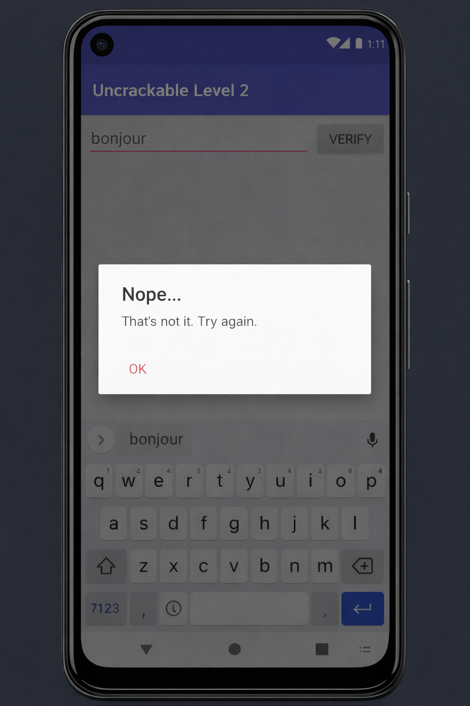
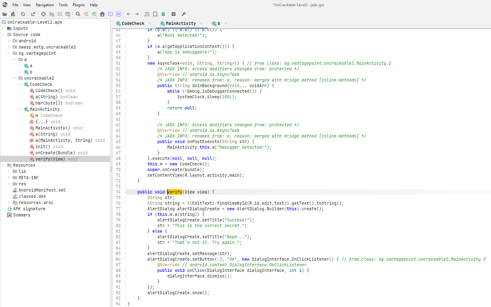
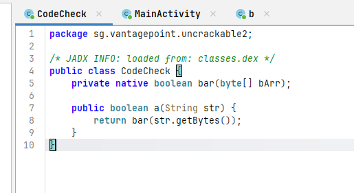
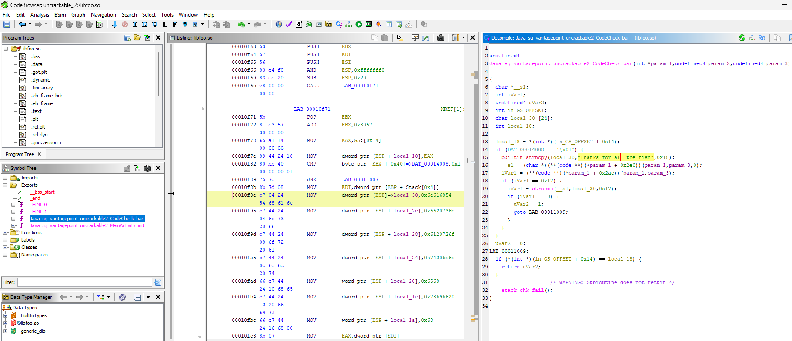
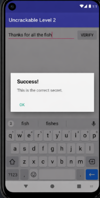

# LAB 5 : Reverse Engineering — UnCrackable Level 2
 
**Cours : Sécurité des applications mobiles**
 
---
 
## Objectif
 
L'objectif de ce lab est de retrouver le secret dissimulé dans l'application Android **UnCrackable Level 2** (OWASP MSTG) en appliquant des techniques d'ingénierie inverse statique : décompilation du bytecode Java avec JADX, analyse du binaire natif via Ghidra, et décodage de la chaîne secrète.
 
---
 
## Partie 1 — Découverte de l'application
 
### Étape 1 — Installer et lancer l'APK
 
Avant toute analyse du code, il convient d'observer le comportement de l'application en conditions réelles. Une bonne démarche d'analyse inverse commence toujours par la surface visible.
 
**Commande d'installation :**
 
```bash
adb install UnCrackable-Level2.apk
```
 
Lancer ensuite l'application depuis l'émulateur ou un appareil physique.
 
**Observation attendue :**
 
L'application présente une interface minimaliste composée d'un champ de saisie et d'un bouton de validation. Le challenge consiste à soumettre la chaîne exacte attendue par l'application.
 
**Checkpoint :** L'APK est installé et l'interface est accessible.
 
---
 
### Étape 2 — Soumettre une valeur incorrecte
 
Saisir une chaîne quelconque pour observer le comportement de l'application en cas d'erreur.
 
**Observation attendue :**
 
L'application réagit immédiatement avec un message de refus.
 
> **Capture 1 — Message d'erreur affiché après une mauvaise saisie**
 

 
*Ici la valeur "bonjour" est saisie — l'application affiche "Nope... That's not it. Try again." pour toute valeur incorrecte.*
 
**Checkpoint :** Il est désormais établi que l'application attend une chaîne spécifique.
 
---
 
## Partie 2 — Localiser le point d'entrée de la vérification
 
### Étape 3 — Décompiler l'APK avec JADX
 
Pour explorer la logique Java de l'application, il faut ouvrir l'APK dans un décompilateur. JADX est l'outil de référence pour cette tâche.
 
**Commande :**
 
```bash
jadx-gui UnCrackable-Level2.apk
```
 
Naviguer ensuite jusqu'à la classe `MainActivity`.
 
### Étape 4 — Identifier l'appel de vérification dans MainActivity
 
La chaîne saisie est passée à une méthode `this.m.a(string)`, ce qui indique qu'un objet `CodeCheck` prend en charge la logique de validation. On peut également observer les mécanismes anti-debug dans la méthode `onCreate`.
 
> **Capture 2 — MainActivity ouverte dans JADX : méthode verify() et appel à CodeCheck**
 

 
*La méthode `verify()` (ligne 74) récupère la saisie utilisateur, l'envoie à `this.m.a(string)` et affiche "Success!" ou "Nope..." selon le résultat. On remarque aussi la détection de root et de debugger dans `onCreate`.*
 
---
 
## Partie 3 — Rôle de la classe CodeCheck
 
### Étape 5 — Retrouver la classe responsable de la vérification
 
La méthode invoquée par `MainActivity` appartient à la classe `CodeCheck`. C'est elle qui assure la liaison entre le code Java et la couche native.
 
**Dans JADX, ouvrir la classe `CodeCheck`.**
 
**Observation attendue :**
 
- Une méthode déclarée `native`, nommée `bar`
- Une méthode `a(String str)` qui convertit la chaîne en tableau de bytes avant d'appeler `bar()`
 
> **Note :** Dans cette version de l'APK, l'instruction `System.loadLibrary("foo")` est définie dans `MainActivity` et non dans `CodeCheck`.
 
> **Capture 3 — Classe CodeCheck dans JADX**
 

 
Code source Java de `CodeCheck` (package `sg.vantagepoint.uncrackable2`) :
 
```java
package sg.vantagepoint.uncrackable2;
 
/* JADX INFO: loaded from: classes.dex */
public class CodeCheck {
    private native boolean bar(byte[] bArr);
 
    public boolean a(String str) {
        return bar(str.getBytes());
    }
}
```
 
**Explication :** Le mot-clé `native` indique que l'implémentation de `bar()` ne se trouve pas dans le bytecode Java, mais dans une bibliothèque compilée (`libfoo.so`), écrite en C ou C++. La méthode `a()` joue le rôle d'intermédiaire entre les deux couches.
 
---
 
## Partie 4 — Extraction de la bibliothèque native
 
### Étape 6 — Décompresser le contenu de l'APK
 
La directive `System.loadLibrary("foo")` présente dans `MainActivity` confirme l'existence d'un fichier `libfoo.so` embarqué dans l'APK.
 
**Commandes :**
 
```bash
apktool d UnCrackable-Level2.apk -o uncrackable_l2
ls -R uncrackable_l2/lib
```
 
**Observation attendue :**
 
L'APK contient plusieurs variantes de la bibliothèque selon l'architecture cible (`x86`, `arm64-v8a`, etc.).
 
> **Capture 4 — Dossier lib/x86 contenant libfoo.so**
 

 
*Le fichier `libfoo.so` (14 KB) est présent dans le répertoire `lib/x86`, chemin complet : `C:\Users\hmami\uncrackable_l2\lib\x86`.*
 
**Checkpoint :** La bibliothèque `libfoo.so` est localisée et prête à être analysée.
 
---
 
## Partie 5 — Analyse du code natif avec Ghidra
 
### Étape 7 — Importer libfoo.so dans Ghidra
 
> Ghidra est un framework open-source d'ingénierie inverse, développé et maintenu par la NSA. Il intègre un désassembleur et un décompilateur permettant d'analyser des binaires compilés.
 
**Lancement :**
 
```bash
c:\ghidra_11.0_PUBLIC\ghidraRun
```
 
Créer un nouveau projet Ghidra, puis importer :
 
```
uncrackable_l2/lib/x86/libfoo.so
```
 
Lancer ensuite l'analyse automatique.
 
### Étape 8 — Retrouver la fonction JNI associée à `bar`
 
Les fonctions JNI exposées par une bibliothèque native suivent une convention de nommage stricte, dérivée du nom du package, de la classe et de la méthode Java correspondante.
 
**Dans Ghidra, rechercher un symbole contenant `Java` ou `CodeCheck_bar`.**
 
**Observation attendue :**
 
La fonction JNI correspondante est exportée sous le nom :
 
```
Java_sg_vantagepoint_uncrackable2_CodeCheck_bar
```
 
---
 
 
## Partie 6 — Décodage du secret
 
### Étape 9 — Identifier la valeur comparée
 
Dans certains cas, la chaîne de référence peut apparaître sous forme hexadécimale ASCII dans les instructions MOV visibles dans le désassembleur Ghidra.
 
**Explication :** Les données dans un binaire natif ne sont pas toujours directement lisibles en texte clair. Elles peuvent être stockées sous forme hexadécimale ou d'autres encodages légers.
 
### Étape 10 — Décoder l'hexadécimal en ASCII (si nécessaire)
 
Si la chaîne se présente sous forme hexadécimale :
 
```python
hex_data = "68616e6b7320666f7220616c6c207468652066697368"
print(bytes.fromhex(hex_data).decode("ascii"))
```
 
**Résultat :**
 
```
hanks for all the fish
```
 
### Étape 11 — Inverser la chaîne pour reconstituer le secret
 
Si la chaîne est stockée en sens inverse :
 
```python
s = "hsif eht lla rof sknahT"
print(s[::-1])
```
 
**Résultat :**
 
```
Thanks for all the fish
```
 
**Explication :** Le secret n'est pas exposé directement dans sa forme finale. Une simple inversion de chaîne a été appliquée pour complexifier légèrement la découverte sans recourir à un chiffrement réel.
 
---
 
## Partie 7 — Validation de la solution
 
### Étape 12 — Entrer le secret dans l'application
 
Retourner dans l'application et saisir la chaîne retrouvée.
 
**Valeur à entrer :**
 
```
Thanks for all the fish
```
 
**Observation attendue :**
 
L'application accepte la chaîne et affiche un message de succès.
 
> **Capture 6 — Message de succès après saisie du bon secret**
 

 
*L'application affiche "Success! This is the correct secret." — le challenge est résolu.*
 
**Checkpoint final :** Le secret a été retrouvé par analyse statique uniquement.
 
---
